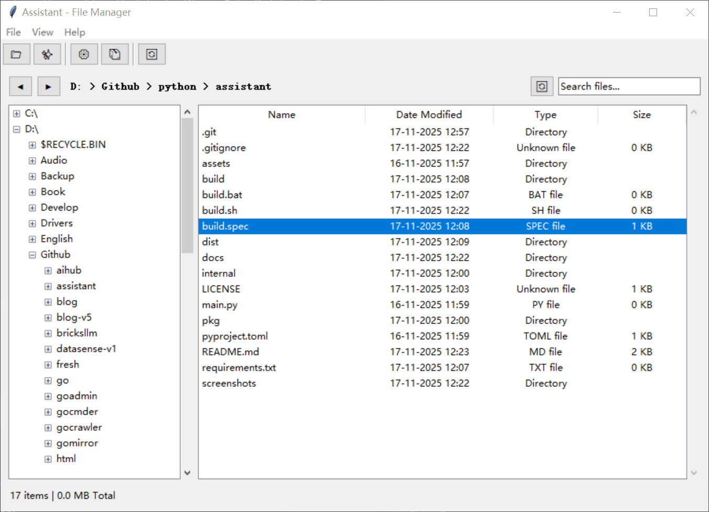
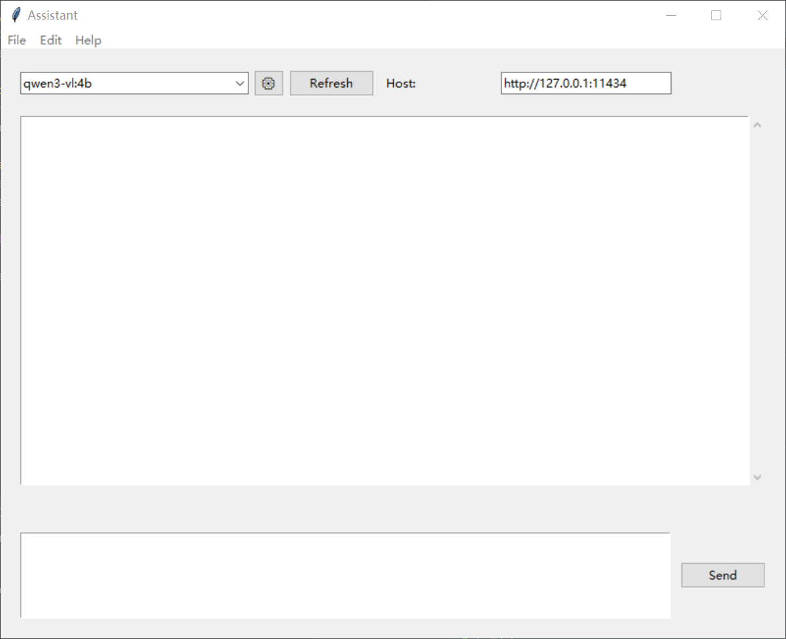

# Assistant

Multi-functional assistant application with file management and chat capabilities.

## Features

- **Chat with AI models via Ollama**
  - Streaming response support
  - Model management (download/delete)
  - Chat history
  - Independent chat window
- **File Management**
  - Left-right layout with directory tree
  - File and directory operations (create, delete, rename, copy, paste)
  - Navigation (back, forward, refresh)
  - Search functionality
  - Context menu for file operations
- System monitoring (planned)

## Screenshots

### Main Window - File Manager


*Main application window with file manager interface (left: directory tree, right: file list)*

### Chat Window


*Independent chat window with streaming AI responses*

> **Note:** Screenshots are located in `docs/scrennshot/` directory. The main window shows the file manager by default, and chat opens in a separate window.

## Requirements

- Python 3.8+
- Ollama service running (for chat feature)

## Installation

```bash
pip install -e .
```

## Usage

### Run from source

```bash
python main.py
```

Or if installed:

```bash
assistant
```

### Run executable

After building (see [Building](docs/BUILD.md)):

```bash
# Windows
dist/assistant.exe

# Linux/Mac
./dist/assistant
```

## Project Structure

```
assistant/
├── main.py                  # Application entry point
├── internal/                # Internal implementation
│   ├── model/              # Data models
│   ├── ui/                 # UI components
│   ├── chat/               # Chat module
│   └── file/               # File management module
├── pkg/                     # Public packages
│   ├── api/                # API clients
│   └── utils/              # Utility functions
└── assets/                 # Static resources
```

## Changelog

See [CHANGELOG.md](docs/CHANGELOG.md) for a list of changes and version history.

## License

MIT

